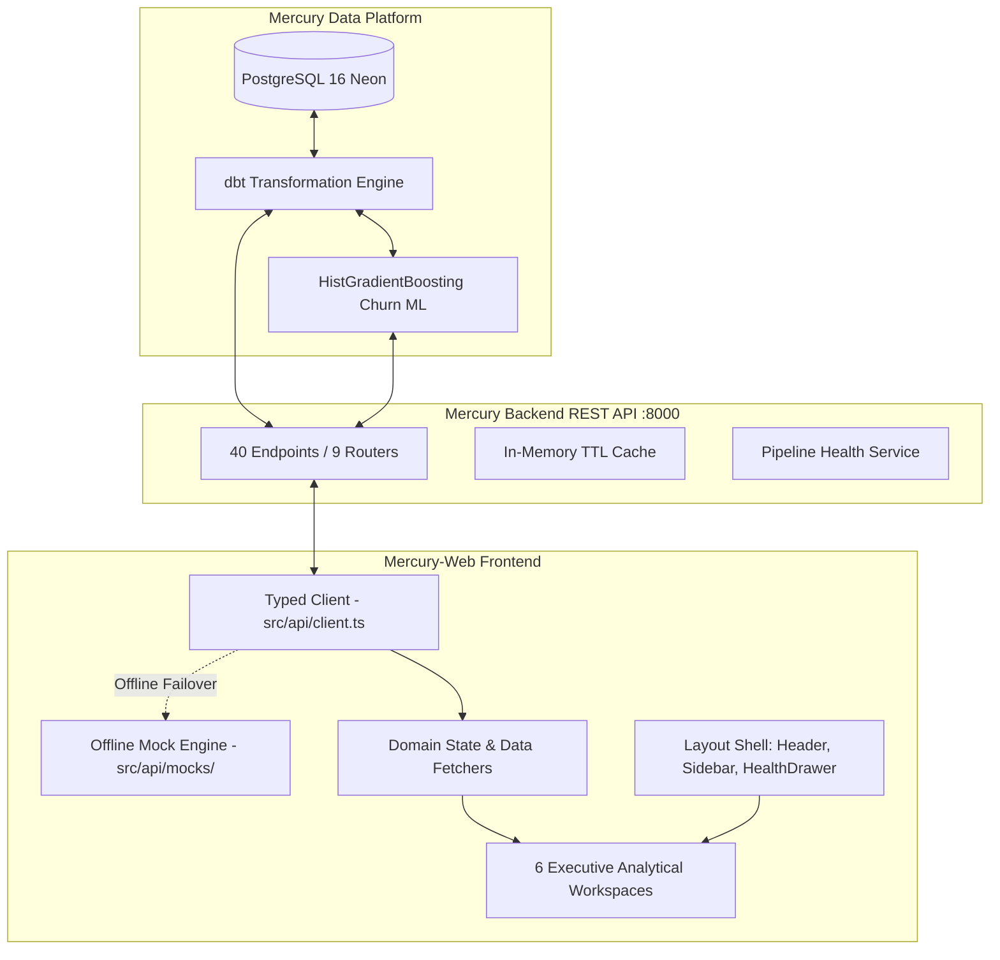

# Mercury-Web Architecture & Client Integration Specification

This document details the frontend system architecture, data flow, component hierarchy, and API contract integration for **Mercury-Web**.

---

## 1. System Topology & Data Flow

Mercury-Web is a single-page application (SPA) built with React 18, TypeScript, and Vite. It interfaces with the Mercury platform ecosystem:



---

## 2. Directory Structure & Modular Layout

```text
mercury-web/
├── docs/                        ← Comprehensive architecture & engineering guides
│   ├── architecture.md          ← System flow, component tree, and contract mapping
│   ├── design_system.md         ← HSL tokens, glassmorphism, and UI primitives
│   ├── api_integration.md       ← Typed fetch client, auth, and offline mocks
│   └── roadmap.md               ← 8-phase engineering roadmap & DoD
├── src/
│   ├── api/                     ← Strongly typed API client & offline resilience
│   │   ├── client.ts            ← Generic typed fetcher with auth & timeout fallback
│   │   ├── index.ts             ← Modular domain API exports
│   │   └── mocks/               ← Realistic Olist fallback mock data
│   ├── components/              ← Component library
│   │   ├── common/              ← Reusable primitives (GlassCard, MetricCard, Badges, Sliders)
│   │   ├── layout/              ← App shell (Sidebar, Header, PipelineHealthDrawer)
│   │   ├── charts/              ← Recharts analytical wrappers
│   │   └── customers/           ← Customer360Modal, RiskMeters, PlaybookRecommendations
│   ├── types/
│   │   └── api.ts               ← Auto-generated OpenAPI 3.1 TypeScript types (4,451 lines)
│   ├── views/                   ← 6 Primary executive page workspaces
│   │   ├── ExecutiveOverviewView.tsx   ← Macro KPIs, revenue trends, RFM matrix
│   │   ├── CustomerDirectoryView.tsx   ← Paginated directory, at-risk queue, CSV export
│   │   ├── ChurnSimulatorView.tsx      ← Real-time what-if counterfactual slider simulator
│   │   ├── RetentionPlannerView.tsx    ← 6 playbooks catalog, campaign ROI, Knapsack optimizer
│   │   ├── MarketingFunnelView.tsx     ← MQL funnel stages, origin attribution, velocity
│   │   └── CatalogIntelligenceView.tsx ← Product category breakdown & seller scorecards
│   ├── App.tsx                  ← Application root shell & router
│   ├── main.tsx                 ← React 18 entrypoint
│   └── index.css                ← Modern CSS design system tokens & glassmorphic utilities
├── openapi.json                 ← Synchronized OpenAPI 3.1 schema specification
├── package.json                 ← Pinned dependencies and build scripts
├── tsconfig.json                ← Strict TypeScript compiler settings
├── vite.config.ts               ← Vite bundler configuration & local backend proxy
└── README.md                    ← Project overview & documentation index
```

---

## 3. Comprehensive 40-Endpoint Contract Mapping Matrix

All 40 endpoints exposed by `Mercury-Backend` are mapped to strongly typed client interfaces in `src/types/api.ts`:

| Router | Method | Path | Response Model | Target View / Component | Primary Responsibility |
|:---|:---:|:---|:---|:---|:---|
| **Health** | `GET` | `/health` | `HealthResponse` | `Header.tsx` | Service availability ping |
| **Health** | `GET` | `/api/health` | `HealthResponse` | `Header.tsx` | Live PostgreSQL connection latency pill |
| **Health** | `GET` | `/api/health/pipeline` | `PipelineHealthResponse` | `PipelineHealthDrawer.tsx` | Table row counts, dbt freshness, model artifact check, anomaly detection alerts |
| **Health** | `GET` | `/` | `Record<string, unknown>` | `Header.tsx` | Root discovery metadata |
| **Auth** | `POST` | `/api/auth/token` | `TokenResponse` | `src/api/client.ts` | JWT bearer token acquisition |
| **Auth** | `GET` | `/api/auth/me` | `UserIdentity` | `Header.tsx` | Identity badge and role indicator |
| **Analytics** | `GET` | `/api/analytics/overview` | `PortfolioOverview` | `ExecutiveOverviewView.tsx` | Macro KPI row: GMV, Churn rate, Revenue at risk, Repeat buyer rate |
| **Analytics** | `GET` | `/api/analytics/segments` | `SegmentsOverview` | `ExecutiveOverviewView.tsx` | RFM segment breakdown grid (11 segments) |
| **Analytics** | `GET` | `/api/analytics/rfm` | `RFMScorecard` | `ExecutiveOverviewView.tsx` | Quintile scorecards & monetary distributions |
| **Analytics** | `GET` | `/api/analytics/revenue-at-risk` | `RevenueAtRiskOverview` | `ExecutiveOverviewView.tsx` | High/Medium/Low risk tier financial exposure |
| **Analytics** | `GET` | `/api/analytics/revenue` | `RevenueAnalyticsResponse` | `ExecutiveOverviewView.tsx` | Chronological revenue & order volume time-series |
| **Analytics** | `GET` | `/api/analytics/retention` | `RetentionAnalyticsResponse` | `ExecutiveOverviewView.tsx` | 12-month cohort retention survival heatmap |
| **Analytics** | `GET` | `/api/analytics/cache/stats` | `Record<string, unknown>` | `PipelineHealthDrawer.tsx` | In-memory cache hit ratio and key telemetry |
| **Analytics** | `POST`| `/api/analytics/cache/clear` | `Record<string, unknown>` | `PipelineHealthDrawer.tsx` | Invalidate cache button |
| **Customers** | `GET` | `/api/customers` | `CustomerListResponse` | `CustomerDirectoryView.tsx` | Paginated customer table with multi-faceted filters and sorting |
| **Customers** | `GET` | `/api/customers/at-risk` | `CustomerListResponse` | `CustomerDirectoryView.tsx` | Priority queue of high-risk customers sorted by monetary exposure |
| **Customers** | `GET` | `/api/customers/segments` | `SegmentsOverview` | `CustomerDirectoryView.tsx` | Segment filter dropdown options |
| **Customers** | `GET` | `/api/customers/export` | `string (CSV)` | `CustomerDirectoryView.tsx` | 1-click filtered CSV download |
| **Customers** | `GET` | `/api/customers/{id}` | `CustomerDetail` | `Customer360Modal.tsx` | Single-customer 360 profile, order history, RFM radar, churn drivers |
| **Customers** | `GET` | `/api/customers/{id}/rfm` | `RFMScorecard` | `Customer360Modal.tsx` | Customer-specific RFM quintile drilldown |
| **Customers** | `GET` | `/api/customers/{id}/churn` | `ChurnPredictionResult` | `Customer360Modal.tsx` | Single-customer churn risk diagnosis |
| **Predictions**| `POST`| `/api/predictions/churn` | `ChurnPredictionResult` | `ChurnSimulatorView.tsx` | On-demand scoring of arbitrary customer feature vectors |
| **Predictions**| `POST`| `/api/predictions/churn/simulate` | `CounterfactualSimulationResponse` | `ChurnSimulatorView.tsx` | What-if counterfactual slider simulator ($\Delta P(\text{Churn})$, $\Delta \text{Revenue at Risk}$) |
| **Predictions**| `POST`| `/api/predictions/churn/simulate/{id}` | `CounterfactualSimulationResponse` | `Customer360Modal.tsx` | Targeted what-if simulation for an existing customer |
| **Predictions**| `GET` | `/api/predictions/model/info` | `ModelMetadataResponse` | `ChurnSimulatorView.tsx` | HistGradientBoosting model specs, ROC-AUC score, feature importances |
| **Retention** | `GET` | `/api/retention/playbooks` | `RetentionPlaybook[]` | `RetentionPlannerView.tsx` | Catalog of 6 prescriptive retention action playbooks |
| **Retention** | `GET` | `/api/retention/playbooks/{id}` | `RetentionPlaybook` | `RetentionPlannerView.tsx` | Playbook modal with action template and unit economics |
| **Retention** | `POST`| `/api/retention/campaigns/simulate-roi` | `CampaignSimulationResult` | `RetentionPlannerView.tsx` | Interactive campaign ROI calculator (Gross savings, Net value, ROI%) |
| **Retention** | `POST`| `/api/retention/campaigns/optimize-budget`| `BudgetAllocationResult` | `RetentionPlannerView.tsx` | Knapsack capital deployment optimizer maximizing recovered GMV |
| **Retention** | `GET` | `/api/retention/recommendations/{id}` | `CustomerPlaybookRecommendation` | `Customer360Modal.tsx` | Automated friction diagnosis & optimal playbook recommendation |
| **Marketing** | `GET` | `/api/marketing/overview` | `MarketingFunnelOverview` | `MarketingFunnelView.tsx` | MQL $\rightarrow$ Closed Deals $\rightarrow$ Active Sellers conversion funnel |
| **Marketing** | `GET` | `/api/marketing/channels` | `ChannelAttributionResponse` | `MarketingFunnelView.tsx` | Origin channel attribution breakdown (lead share, revenue, velocity) |
| **Marketing** | `GET` | `/api/marketing/velocity` | `SalesVelocityMetrics` | `MarketingFunnelView.tsx` | Sales cycle duration (days to close) distribution |
| **Marketing** | `GET` | `/api/marketing/segments` | `SegmentPerformanceResponse` | `MarketingFunnelView.tsx` | Business segment declared vs actual GMV realization |
| **Marketing** | `GET` | `/api/marketing/leads` | `MarketingLeadsListResponse` | `MarketingFunnelView.tsx` | Paginated marketing qualified lead directory with multi-filter search |
| **Products** | `GET` | `/api/products` | `ProductListResponse` | `CatalogIntelligenceView.tsx` | Paginated product search with category & rating filters |
| **Products** | `GET` | `/api/products/categories` | `CategoryListResponse` | `CatalogIntelligenceView.tsx` | Product category sales volume, revenue, and average rating |
| **Products** | `GET` | `/api/products/{id}` | `ProductSummary` | `CatalogIntelligenceView.tsx` | Product scorecard with dimensions and sales velocity |
| **Sellers** | `GET` | `/api/sellers` | `SellerListResponse` | `CatalogIntelligenceView.tsx` | Paginated marketplace seller directory with delivery delay ratings |
| **Sellers** | `GET` | `/api/sellers/{id}` | `SellerSummary` | `CatalogIntelligenceView.tsx` | Seller 360 profile with top categories and fulfillment delay metrics |

---

## 4. Key Customer Identity Resolution Constraint

```text
               ┌──────────────────────┐
               │    raw.customers     │
               └──────────┬───────────┘
                          │
          ┌───────────────┴───────────────┐
          ▼                               ▼
    customer_id                   customer_unique_id
(Order-scoped token)            (True returning human)
  - 1 per purchase order         - 1 per returning patron
  - Never used for aggregations  - Keys all RFM, ML & Profiles
```

In the Olist Brazilian E-Commerce dataset, `customer_id` is an ephemeral purchase token generated for each individual checkout transaction. The persistent returning customer key is `customer_unique_id`. All customer metrics, churn models, retention queues, and detail lookups strictly require `customer_unique_id`.
