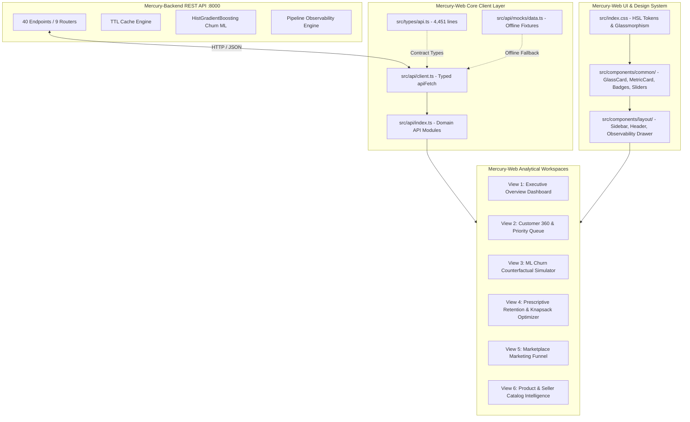
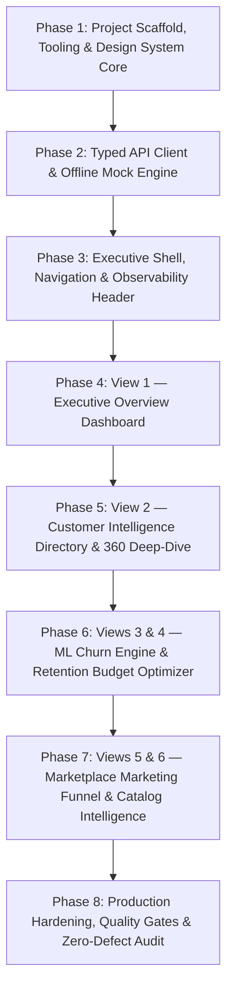

# Mercury-Web Engineering Roadmap & Implementation Specification

This document defines the comprehensive engineering roadmap, technical architecture, and phased implementation specification for **Mercury-Web** — the executive customer intelligence, predictive churn simulation, and retention analytics web dashboard for the Mercury platform.

---

## 1. Executive Summary & Project Baseline

### 1.1 Project Identity & Purpose
Mercury-Web is an executive cockpit designed for C-level leaders, VP of Growth, and Customer Success Executives. It consumes the **Mercury Backend REST API (40 live endpoints, 61 schemas)** using strongly typed TypeScript contracts generated from OpenAPI 3.1 (`src/types/api.ts`).

The application transforms complex e-commerce transaction logs (Olist Brazilian dataset: 100k+ orders, 96k+ customers, 3k+ sellers, 32k+ products) into actionable retention strategies, interactive ML counterfactual simulations, and Knapsack-optimized capital allocation plans.

### 1.2 Core Architectural Principles
1. **Contract-First Type Safety**: All API requests and responses strictly adhere to `src/types/api.ts` (4,451 lines, generated from backend `openapi.json`). No untyped `any` or ad-hoc payload structures.
2. **Offline Resilience & Zero-Flicker Fallbacks**: The frontend operates seamlessly whether connected to a live Uvicorn backend (`http://localhost:8000`) or running offline in presentation mode, using realistic fallback mock fixtures (`src/api/mocks/data.ts`).
3. **High Executive Information Density**: Dense, high-contrast visual hierarchy prioritizing macro KPIs, natural-language business takeaways, delta indicators, and interactive sensitivity sliders.
4. **Rich Dark Glassmorphism Design System**: Built with modern CSS using curated HSL design tokens, deep navy/slate canvas (`#0b0f19`), backdrop blur (`16px`), subtle translucent borders (`hsla(217, 33%, 25%, 0.45)`), and neon status accents.
5. **No Placeholders**: Every card, table, chart, and modal renders realistic production metrics mirroring real Olist data distributions.

---

## 2. High-Level Architecture & Data Flow



---

## 3. Comprehensive 40-Endpoint to View Mapping Matrix

The table below maps all 40 endpoints from `Mercury-Backend` to their corresponding Mercury-Web views, components, and contract schemas:

| Router | Method | Path | Response Model | Mercury-Web Component / View | Primary Functionality |
|:---|:---:|:---|:---|:---|:---|
| **Health** | `GET` | `/health` | `HealthResponse` | `Header.tsx` | Basic backend service heartbeat |
| **Health** | `GET` | `/api/health` | `HealthResponse` | `Header.tsx` | Live PostgreSQL connection latency pill |
| **Health** | `GET` | `/api/health/pipeline` | `PipelineHealthResponse` | `PipelineHealthDrawer.tsx` | Real-time table row counts, dbt freshness, model artifact check, anomaly detection alerts |
| **Health** | `GET` | `/` | `Record<string, unknown>` | `Header.tsx` | Root discovery metadata |
| **Auth** | `POST` | `/api/auth/token` | `TokenResponse` | `src/api/client.ts` | JWT bearer token acquisition |
| **Auth** | `GET` | `/api/auth/me` | `UserIdentity` | `Header.tsx` | Identity badge and role indicator |
| **Analytics** | `GET` | `/api/analytics/overview` | `PortfolioOverview` | `ExecutiveOverviewView.tsx` | Macro KPI row: GMV, Churn rate, Revenue at risk, Repeat buyer rate |
| **Analytics** | `GET` | `/api/analytics/segments` | `SegmentsOverview` | `ExecutiveOverviewView.tsx` | RFM segment breakdown grid (11 segments) |
| **Analytics** | `GET` | `/api/analytics/rfm` | `RFMScorecard` | `ExecutiveOverviewView.tsx` | Quintile scorecards & monetary distributions |
| **Analytics** | `GET` | `/api/analytics/revenue-at-risk` | `RevenueAtRiskOverview` | `ExecutiveOverviewView.tsx` | High/Medium/Low risk tier financial exposure |
| **Analytics** | `GET` | `/api/analytics/revenue` | `RevenueAnalyticsResponse` | `ExecutiveOverviewView.tsx` | Chronological revenue & order volume time-series (Recharts Area/Bar) |
| **Analytics** | `GET` | `/api/analytics/retention` | `RetentionAnalyticsResponse` | `ExecutiveOverviewView.tsx` | 12-month cohort retention survival heatmap |
| **Analytics** | `GET` | `/api/analytics/cache/stats` | `Record<string, unknown>` | `PipelineHealthDrawer.tsx` | In-memory cache hit ratio and key telemetry |
| **Analytics** | `POST`| `/api/analytics/cache/clear` | `Record<string, unknown>` | `PipelineHealthDrawer.tsx` | Invalidate cache button |
| **Customers** | `GET` | `/api/customers` | `CustomerListResponse` | `CustomerDirectoryView.tsx` | Paginated customer table with multi-faceted filters and sorting |
| **Customers** | `GET` | `/api/customers/at-risk` | `CustomerListResponse` | `CustomerDirectoryView.tsx` | Priority queue of high-risk customers sorted by monetary exposure |
| **Customers** | `GET` | `/api/customers/segments` | `SegmentsOverview` | `CustomerDirectoryView.tsx` | Segment filter dropdown options |
| **Customers** | `GET` | `/api/customers/export` | `string (CSV)` | `CustomerDirectoryView.tsx` | 1-click filtered CSV download |
| **Customers** | `GET` | `/api/customers/{id}` | `CustomerDetail` | `Customer360Modal.tsx` | Single-customer 360 profile, order history, RFM radar, churn drivers |
| **Customers** | `GET` | `/api/customers/{id}/rfm` | `RFMScorecard` | `Customer360Modal.tsx` | Customer-specific RFM quintile drilldown |
| **Customers** | `GET` | `/api/customers/{id}/churn` | `ChurnPredictionResult` | `Customer360Modal.tsx` | Single-customer churn risk diagnosis |
| **Predictions**| `POST`| `/api/predictions/churn` | `ChurnPredictionResult` | `ChurnSimulatorView.tsx` | On-demand scoring of arbitrary customer feature vectors |
| **Predictions**| `POST`| `/api/predictions/churn/simulate` | `CounterfactualSimulationResponse` | `ChurnSimulatorView.tsx` | What-if counterfactual slider simulator ($\Delta P(\text{Churn})$, $\Delta \text{Revenue at Risk}$) |
| **Predictions**| `POST`| `/api/predictions/churn/simulate/{id}` | `CounterfactualSimulationResponse` | `Customer360Modal.tsx` | Targeted what-if simulation for an existing customer |
| **Predictions**| `GET` | `/api/predictions/model/info` | `ModelMetadataResponse` | `ChurnSimulatorView.tsx` | HistGradientBoosting model specs, ROC-AUC score, feature importances |
| **Retention** | `GET` | `/api/retention/playbooks` | `RetentionPlaybook[]` | `RetentionPlannerView.tsx` | Catalog of 6 prescriptive retention action playbooks |
| **Retention** | `GET` | `/api/retention/playbooks/{id}` | `RetentionPlaybook` | `RetentionPlannerView.tsx` | Playbook modal with action template and unit economics |
| **Retention** | `POST`| `/api/retention/campaigns/simulate-roi` | `CampaignSimulationResult` | `RetentionPlannerView.tsx` | Interactive campaign ROI calculator (Gross savings, Net value, ROI%) |
| **Retention** | `POST`| `/api/retention/campaigns/optimize-budget`| `BudgetAllocationResult` | `RetentionPlannerView.tsx` | Knapsack capital deployment optimizer maximizing recovered GMV |
| **Retention** | `GET` | `/api/retention/recommendations/{id}` | `CustomerPlaybookRecommendation` | `Customer360Modal.tsx` | Automated friction diagnosis & optimal playbook recommendation |
| **Marketing** | `GET` | `/api/marketing/overview` | `MarketingFunnelOverview` | `MarketingFunnelView.tsx` | MQL $\rightarrow$ Closed Deals $\rightarrow$ Active Sellers conversion funnel |
| **Marketing** | `GET` | `/api/marketing/channels` | `ChannelAttributionResponse` | `MarketingFunnelView.tsx` | Origin channel attribution breakdown (lead share, revenue, velocity) |
| **Marketing** | `GET` | `/api/marketing/velocity` | `SalesVelocityMetrics` | `MarketingFunnelView.tsx` | Sales cycle duration (days to close) distribution |
| **Marketing** | `GET` | `/api/marketing/segments` | `SegmentPerformanceResponse` | `MarketingFunnelView.tsx` | Business segment declared vs actual GMV realization |
| **Marketing** | `GET` | `/api/marketing/leads` | `MarketingLeadsListResponse` | `MarketingFunnelView.tsx` | Paginated marketing qualified lead directory with multi-filter search |
| **Products** | `GET` | `/api/products` | `ProductListResponse` | `CatalogIntelligenceView.tsx` | Paginated product search with category & rating filters |
| **Products** | `GET` | `/api/products/categories` | `CategoryListResponse` | `CatalogIntelligenceView.tsx` | Product category sales volume, revenue, and average rating |
| **Products** | `GET` | `/api/products/{id}` | `ProductSummary` | `CatalogIntelligenceView.tsx` | Product scorecard with dimensions and sales velocity |
| **Sellers** | `GET` | `/api/sellers` | `SellerListResponse` | `CatalogIntelligenceView.tsx` | Paginated marketplace seller directory with delivery delay ratings |
| **Sellers** | `GET` | `/api/sellers/{id}` | `SellerSummary` | `CatalogIntelligenceView.tsx` | Seller 360 profile with top categories and fulfillment delay metrics |

---

## 4. Phased Engineering Roadmap

The roadmap is decomposed into **8 structured, verifiable phases**:



---

### Phase 1: Project Scaffold, Tooling & Design System Core (✅ Complete)

#### 1.1 Goal
Establish the Vite + React 18 + TypeScript environment, configure strict type-checking and ESLint, and define the complete glassmorphic design token system in `src/index.css`.

#### 1.2 Concrete Deliverables
- [package.json](file:///Users/gab/Documents/GitHub/Mercury-Web/package.json): React 18, TypeScript 5, Vite 5, Recharts, Lucide-React, Clsx, ESLint.
- [vite.config.ts](file:///Users/gab/Documents/GitHub/Mercury-Web/vite.config.ts): React plugin, `@/*` path alias resolution, and development proxy mapping `/api` and `/health` to `http://localhost:8000`.
- [tsconfig.json](file:///Users/gab/Documents/GitHub/Mercury-Web/tsconfig.json) & [tsconfig.node.json](file:///Users/gab/Documents/GitHub/Mercury-Web/tsconfig.node.json): Strict type configuration (`noImplicitAny`, `strictNullChecks`, `noUnusedLocals`).
- [index.html](file:///Users/gab/Documents/GitHub/Mercury-Web/index.html): Executive title, viewport meta, Google Fonts (`Outfit:400,500,600,700,800` & `Inter:300,400,500,600,700`).
- [src/index.css](file:///Users/gab/Documents/GitHub/Mercury-Web/src/index.css):
  - **Color Tokens**:
    - Deep Canvas: `hsl(222, 47%, 7%)` (`#0b0f19`)
    - Surface Panel: `hsla(222, 40%, 12%, 0.75)` with `backdrop-filter: blur(16px)`
    - Surface Border: `1px solid hsla(217, 33%, 25%, 0.45)`
    - Emerald (Revenue & Low Risk): `hsl(158, 64%, 52%)` (`#34d399`)
    - Crimson (Churn Risk & High Exposure): `hsl(354, 70%, 54%)` (`#f43f5e`)
    - Violet (ML Predictions & Simulations): `hsl(263, 70%, 58%)` (`#8b5cf6`)
    - Amber (Warnings & Medium Risk): `hsl(38, 92%, 50%)` (`#fbbf24`)
    - Cyan (Marketing & B2B Funnel): `hsl(199, 89%, 48%)` (`#38bdf8`)
  - **Reusable Utility Classes**: Glass panels, gradient text, glowing card borders, custom scrollbars, and metric sparklines.
- **Common UI Primitives**:
  - `src/components/common/GlassCard.tsx`: Reusable container with backdrop blur, hover elevation, and action header.
  - `src/components/common/MetricCard.tsx`: Display KPI card with sparkline trend delta, natural language takeaway, and icon badge.
  - `src/components/common/Badges.tsx`: `RiskTierBadge`, `SegmentBadge`, and `PriorityBadge`.
  - `src/components/common/Slider.tsx`: Controlled range slider with tick marks and delta value badges for what-if simulations.

#### 1.3 Definition of Done
- `npm install` completes cleanly with zero dependency vulnerabilities.
- `src/index.css` compiles without syntax errors and renders the dark canvas.
- Reusable primitives render accurately in isolation.

---

### Phase 2: Strongly-Typed API Client Architecture & Offline Mock Engine

#### 2.1 Goal
Create a 100% type-safe fetch wrapper consuming `src/types/api.ts` with transparent failover to comprehensive mock data when the backend is offline.

#### 2.2 Concrete Deliverables
- [src/api/client.ts](file:///Users/gab/Documents/GitHub/Mercury-Web/src/api/client.ts):
  - Generic typed fetcher: `apiFetch<P extends keyof paths, M extends keyof paths[P]>(path: P, method: M, options?: {...})`.
  - Injects `X-API-Key` or `Authorization: Bearer <token>` from environment (`VITE_API_KEY`, `VITE_AUTH_TOKEN`).
  - Timeout handling (5000ms) with automatic failover to `src/api/mocks/data.ts` if backend connection fails.
- [src/api/mocks/data.ts](file:///Users/gab/Documents/GitHub/Mercury-Web/src/api/mocks/data.ts):
  - Realistic Olist fixtures for all 40 endpoints:
    - `mockPortfolioOverview`: R$ 15.9M GMV, 96,096 customers, 2.99% repeat buyer rate, 18.4% high risk rate, R$ 2.45M revenue at risk.
    - `mockSegmentsOverview`: 11 RFM segments with customer counts and revenue shares.
    - `mockRevenueTrends`: 18 monthly historical data points (Jan 2017 – Aug 2018).
    - `mockCohortRetention`: 12-month cohort decay matrix.
    - `mockCustomers`: 50+ individual customer records spanning all RFM segments and risk tiers.
    - `mockPlaybooks`: 6 canonical retention playbooks.
    - `mockMarketingFunnel`: 8,000 MQLs, 842 closed deals (10.5% conversion), sales velocity, channel attribution.
    - `mockPipelineHealth`: Status OK, 42ms Neon PostgreSQL latency, table counts, and model artifact status.
- [src/api/index.ts](file:///Users/gab/Documents/GitHub/Mercury-Web/src/api/index.ts):
  - Modular domain API wrappers: `analyticsApi`, `customersApi`, `predictionsApi`, `retentionApi`, `marketingApi`, `catalogApi`, `healthApi`.

#### 2.3 Definition of Done
- TypeScript compiles cleanly with zero type errors across all API client calls.
- Calling `apiFetch('/api/analytics/overview', 'get')` returns typed `PortfolioOverview` in both live and offline environments.

---

### Phase 3: Executive Shell, Navigation & Observability Header

#### 3.1 Goal
Construct the persistent application layout, executive navigation sidebar, top status header with live latency diagnostics, and a slide-over Pipeline Observability Drawer.

#### 3.2 Concrete Deliverables
- [src/components/layout/Sidebar.tsx](file:///Users/gab/Documents/GitHub/Mercury-Web/src/components/layout/Sidebar.tsx):
  - Navigation links: Overview, Customers & 360, Churn Simulator, Retention Planner, Marketing Funnel, Catalog Intelligence.
  - Active tab indicator with violet glow, count badges (e.g. at-risk queue count: 17,680), and collapsible state.
- [src/components/layout/Header.tsx](file:///Users/gab/Documents/GitHub/Mercury-Web/src/components/layout/Header.tsx):
  - Top bar featuring Mercury branding, active view breadcrumbs, quick customer lookup search bar, and environment indicator pill (`Development / Production`).
  - Real-time pipeline health badge: pings `GET /api/health/pipeline`, displays green/yellow/red pulse indicator with latency in ms.
- [src/components/layout/PipelineHealthDrawer.tsx](file:///Users/gab/Documents/GitHub/Mercury-Web/src/components/layout/PipelineHealthDrawer.tsx):
  - Slide-over drawer detailing:
    - Current table row counts across `raw.orders`, `mart_customer_metrics`, `ml.churn_predictions`.
    - Data freshness and timestamp of last order.
    - Model artifact status (`churn_model.joblib` existence, size, algorithm).
    - Automated anomaly detection banner (e.g. coverage ratio, missing data alerts).
    - Cache statistics and one-click "Purge Analytics Cache" button (`POST /api/analytics/cache/clear`).

#### 3.3 Definition of Done
- Navigation switches views smoothly without full page reloads.
- Clicking the pipeline badge opens the slide-over drawer displaying live or mock telemetry.

---

### Phase 4: View 1 — Executive Overview Dashboard

#### 4.1 Goal
Deliver the executive command center displaying macro portfolio health, revenue exposure, time-series trends, and RFM cohort dynamics.

#### 4.2 Concrete Deliverables
- [src/views/ExecutiveOverviewView.tsx](file:///Users/gab/Documents/GitHub/Mercury-Web/src/views/ExecutiveOverviewView.tsx):
  - **Macro KPI Row (5 Cards)**:
    1. *Total Portfolio GMV*: R$ 15.98M (+12.4% vs last period).
    2. *Active Customers*: 96,096 unique buyers.
    3. *High Churn Risk Rate*: 18.4% (17,680 customers at risk).
    4. *Portfolio Revenue at Risk*: R$ 2.45M (15.3% of total GMV).
    5. *Repeat Buyer Rate*: 2.99% (highlighting retention opportunity).
  - **Interactive Revenue Trends Chart**:
    - Recharts ComposedChart (Area + Bar) rendering monthly GMV, delivered order counts, and average order value.
    - Date range filter selector (All Time, Last 12 Months, Last 6 Months).
  - **RFM Customer Segmentation Matrix**:
    - 11-segment visual grid cards (Champions, Loyal Customers, At Risk, Can't Lose Them, etc.) with customer count, GMV contribution, and average churn probability.
  - **Cohort Retention Heatmap**:
    - Matrix grid showing survival retention rates across monthly acquisition cohorts from Period 0 to Period 12+.
  - **Revenue-at-Risk Breakdown**:
    - Segmented progress bars for High Risk ($P \ge 0.70$), Medium Risk ($0.40 \le P < 0.70$), and Low Risk ($P < 0.40$), featuring Priority 1 (VIP Retention) callout.

#### 4.3 Definition of Done
- All charts render responsively with interactive tooltips.
- Visual hierarchy guides executive attention immediately to revenue exposure.

---

### Phase 5: View 2 — Customer Intelligence Directory & 360 Deep-Dive

#### 5.1 Goal
Provide an operational directory for filtering customers, prioritizing intervention queues, exporting lists, and inspecting single-customer 360 profiles.

#### 5.2 Concrete Deliverables
- [src/views/CustomerDirectoryView.tsx](file:///Users/gab/Documents/GitHub/Mercury-Web/src/views/CustomerDirectoryView.tsx):
  - Dual tabs: **All Customers** vs **Priority At-Risk Queue** (`/api/customers/at-risk`).
  - Search input (Customer Unique ID, City, State) with 300ms debounce.
  - Multi-select filters: RFM Segment (Champions, Loyal, etc.), Risk Tier (High, Medium, Low), State (SP, RJ, MG, etc.).
  - 1-click **Export to CSV** button invoking `GET /api/customers/export`.
  - High-density paginated data table: Customer Unique ID, Segment badge, Lifetime Spend, Lifetime Orders, Churn Probability $P(\text{Churn})$, Revenue at Risk, and Action Button.
- [src/components/customers/Customer360Modal.tsx](file:///Users/gab/Documents/GitHub/Mercury-Web/src/components/customers/Customer360Modal.tsx):
  - Slide-over profile displaying:
    - Customer Header: Unique ID, geographic location, tenure (days), lifetime spend.
    - Churn Risk Meter: Radial progress gauge displaying $P(\text{Churn})$, Risk Tier, and Retention Priority.
    - Top Risk Factors: Shapley feature contributions (e.g. delivery delays, review ratings, recency).
    - Basket & Fulfillment Metrics: Avg order value, freight ratio, delivery delay days, late delivery flag.
    - Prescriptive Playbook Recommendation: Fetches `GET /api/retention/recommendations/{id}`, displays optimal playbook name, action template, and estimated save rate.

#### 5.3 Definition of Done
- Filtering updates table rows instantly without layout shift.
- Clicking any row opens the Customer 360 drawer with fully populated metrics and recommendations.

---

### Phase 6: Views 3 & 4 — ML Churn Engine & Retention Budget Optimizer

#### 6.1 Goal
Build interactive simulation workspaces empowering leaders to model what-if scenarios and optimize retention capital allocation using Knapsack economics.

#### 6.2 Concrete Deliverables
- [src/views/ChurnSimulatorView.tsx](file:///Users/gab/Documents/GitHub/Mercury-Web/src/views/ChurnSimulatorView.tsx):
  - **What-If Counterfactual Simulator** (`POST /api/predictions/churn/simulate`):
    - Real-time controlled sliders:
      - Delivery Delay Adjustment: $-10$ days to $+10$ days.
      - Review Score Delta: $-2.0$ stars to $+2.0$ stars.
      - Discount Incentive: $0\%$ to $30\%$.
      - Order Frequency Delta: $-2$ to $+5$ orders.
    - Live Delta Card: Visualizes $\Delta P(\text{Churn})$, $\Delta \text{Revenue at Risk}$, Before-and-After Risk Tier transitions.
    - Executive Natural Language Impact Summary (e.g. *"Reducing delivery delay by 4 days lowers churn probability by 18.2%, protecting R$ 145,200 in revenue"*).
    - Customer Lookup Mode: Load any customer unique ID to hydrate baseline features from DB.
    - Model Transparency Card (`GET /api/predictions/model/info`): HistGradientBoosting algorithm parameters, ROC-AUC score (0.87+), training date, and top feature weights.
- [src/views/RetentionPlannerView.tsx](file:///Users/gab/Documents/GitHub/Mercury-Web/src/views/RetentionPlannerView.tsx):
  - **Playbooks Catalog**: Cards for all 6 prescriptive retention strategies (`vip_concierge`, `logistics_friction_recovery`, `sentiment_repair_service`, `automated_reengagement`, `loyalty_nurture`, `organic_nurture`) showing unit costs, save rates, and outreach templates.
  - **Campaign ROI Simulator** (`POST /api/retention/campaigns/simulate-roi`):
    - Controls for target customer count, cost per customer, and expected save rate.
    - Dynamic calculation: Total Cost, Gross Revenue Saved, Net Value Created, ROI %, Break-Even Save Rate.
  - **Knapsack Capital Deployment Optimizer** (`POST /api/retention/campaigns/optimize-budget`):
    - Total Budget Slider (R$ 5,000 to R$ 250,000).
    - Visual knapsack allocation bars showing funded vs unfunded customer candidate pools.
    - Scorecard: Allocated Budget, Remaining Budget, Customers Targeted, Total Net Value, Portfolio Efficiency.

#### 6.3 Definition of Done
- Sliders debounce API calls cleanly (300ms) and render smooth delta transitions.
- Budget slider recalculates Knapsack allocation and returns non-negative remaining budget.

---

### Phase 7: Views 5 & 6 — Marketplace Marketing Funnel & Catalog Intelligence

#### 7.1 Goal
Provide analytical visibility into the two-sided marketplace seller acquisition funnel and product/seller catalog intelligence.

#### 7.2 Concrete Deliverables
- [src/views/MarketingFunnelView.tsx](file:///Users/gab/Documents/GitHub/Mercury-Web/src/views/MarketingFunnelView.tsx):
  - **Visual Funnel Conversion Stages**:
    - MQLs (8,000) $\longrightarrow$ Won Deals (842, 10.5% conversion) $\longrightarrow$ Active Marketplace Sellers (420, 49.9% activation).
  - **Funnel Scorecards**: Overall Conversion Rate, Avg Days to Close (18 days), Declared Monthly Revenue vs Actual Realized GMV.
  - **Origin Channel Attribution**: Bar chart of lead share, conversion efficiency, and GMV across channels (Organic, Paid Search, Social, Direct, Email).
  - **Sales Velocity Distribution**: Days to close by business segment and lead type.
  - **Marketing Leads Directory**: Paginated table of leads with SDR/SR assignments and status filters.
- [src/views/CatalogIntelligenceView.tsx](file:///Users/gab/Documents/GitHub/Mercury-Web/src/views/CatalogIntelligenceView.tsx):
  - **Product Categories Scorecard**: Sales volume, revenue share, average review ratings, and repeat order rates across categories (`bed_bath_table`, `health_beauty`, `sports_leisure`, `computers_accessories`, etc.).
  - **Marketplace Sellers Scorecard**: Directory of sellers with on-time delivery percentages, customer review scores, order volumes, and freight delay risks.

#### 7.3 Definition of Done
- Funnel and catalog views populate with zero missing data errors.
- Charts provide clear comparative context for marketplace operations.

---

### Phase 8: Production Hardening, Quality Gates & Zero-Defect Audit

#### 8.1 Goal
Execute comprehensive validation against all Definition of Done (DoD) criteria, optimize production bundle performance, and configure automated GitHub Actions CI.

#### 8.2 Concrete Deliverables
- [src/App.tsx](file:///Users/gab/Documents/GitHub/Mercury-Web/src/App.tsx) & [src/main.tsx](file:///Users/gab/Documents/GitHub/Mercury-Web/src/main.tsx):
  - Main application router shell wiring state, toast notifications, error boundaries, and drawer toggles.
- **Type Safety Audit**:
  ```bash
  npx tsc --noEmit
  ```
  Must pass with **0 errors**.
- **Linter & Code Style Audit**:
  ```bash
  npm run lint
  ```
  Must pass with **0 warnings and 0 errors**.
- **Production Build Optimization**:
  ```bash
  npm run build
  ```
  Vite production bundle compilation with chunk splitting (vendor, recharts, lucide).
- **Responsive Layout Audit**:
  - Validated at 1920px (4K/Desktop), 1440px (Standard Laptop), 1024px (Tablet Landscape), 768px (Tablet Portrait).
- **CI Workflow** (`.github/workflows/web-ci.yml`):
  - Automated Node.js matrix test checking type safety, linting, and build on pull requests.

#### 8.3 Definition of Done
- Code passes all automated CI checks.
- Zero layout overflow or unhandled exceptions across all 6 views.

---

## 5. Mathematical & Business Methodologies

### 5.1 Customer Key Resolution
$$\text{Customer Aggregate} = f(\text{customer\_unique\_id}), \quad \text{where } \text{customer\_id} \in \text{Orders}$$

### 5.2 RFM Quintile Scoring
For each metric $X \in \{R, F, M\}$:
$$\text{Score}(X) \in \{1, 2, 3, 4, 5\}, \quad \text{based on empirical percentiles } P_{20}, P_{40}, P_{60}, P_{80}$$
Segments are assigned via the 11-segment lookup matrix based on $(R, F, M)$ tuples.

### 5.3 Revenue at Risk
$$\text{Revenue at Risk} = \text{CLV}_i \times P(\text{Churn}_i)$$

### 5.4 Counterfactual Sensitivity
$$\Delta P(\text{Churn}) = P(\text{Churn} \mid \mathbf{x} + \Delta \mathbf{x}) - P(\text{Churn} \mid \mathbf{x})$$
$$\Delta \text{Revenue at Risk} = \text{CLV}_i \times \Delta P(\text{Churn})$$

### 5.5 Knapsack Retention Budget Optimization
Given budget constraint $B$ and $K$ candidate customer risk cohorts:
$$\max \sum_{k=1}^K x_k \cdot \text{NetValue}_k \quad \text{subject to} \quad \sum_{k=1}^K x_k \cdot \text{Cost}_k \le B, \quad x_k \in [0, 1]$$
Where:
$$\text{Cost}_k = N_k \times \text{CostPerCustomer}_k$$
$$\text{GrossSaved}_k = \text{Spend}_k \times \text{SaveRate}_k$$
$$\text{NetValue}_k = \text{GrossSaved}_k - \text{Cost}_k$$

---

## 6. Definition of Done (DoD) Checklist

| Criteria | Standard | Verification Method |
|:---|:---|:---|
| **Compilation** | Zero TypeScript compilation errors (`noImplicitAny`, strict mode) | `npx tsc --noEmit` |
| **Linting** | Zero ESLint errors or warnings | `npm run lint` |
| **Bundle Build** | Clean Vite production bundle in `dist/` | `npm run build` |
| **Contract Adherence** | 100% adherence to `src/types/api.ts` (40 endpoints, 61 schemas) | Static type analysis |
| **Offline Resilience** | All views fully interactive with realistic fallback mock data | Disconnect network test |
| **Responsiveness** | Clean responsive grid and flex layouts across 768px to 1920px | Chrome DevTools viewport testing |
| **Visual WOW Factor** | Dark glassmorphism, Outfit/Inter fonts, smooth micro-interactions | Design system audit |
