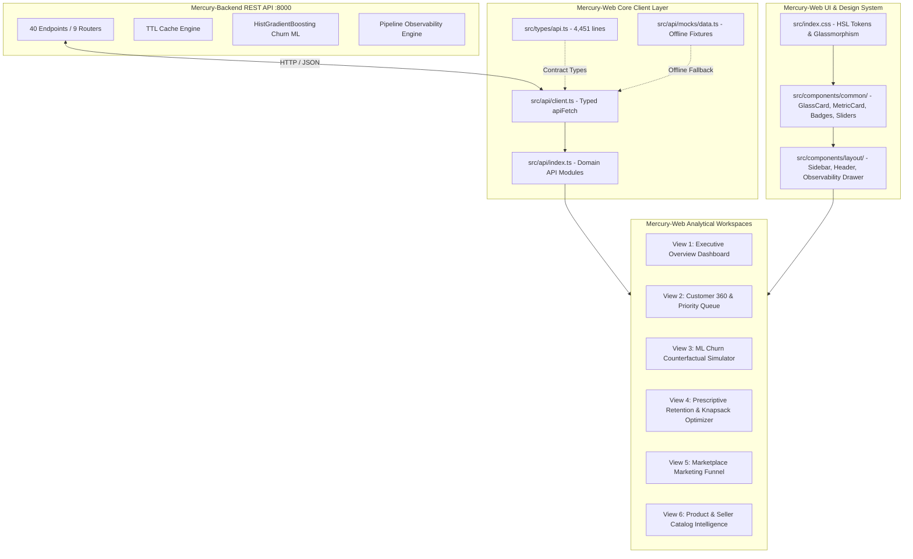
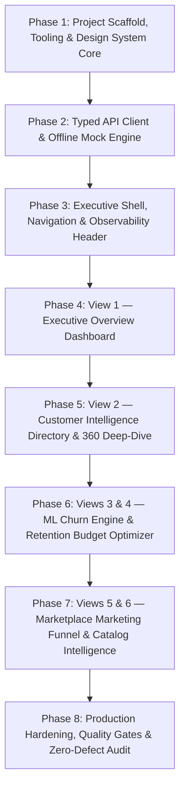

# Mercury-Web Engineering Roadmap & Implementation Specification

This document defines the comprehensive engineering roadmap, technical architecture, and phased implementation specification for **Mercury-Web** — the executive customer intelligence, predictive churn simulation, and retention analytics web dashboard for the Mercury platform.

---

## 1. Executive Summary & Project Baseline

### 1.1 Project Identity & Purpose
Mercury-Web is an executive cockpit designed for C-level leaders, VP of Growth, and Customer Success Executives. It consumes the **Mercury Backend REST API (40 live endpoints, 61 schemas)** using strongly typed TypeScript contracts generated from OpenAPI 3.1 (`src/types/api.ts`).

The application transforms complex e-commerce transaction logs (Olist Brazilian dataset: 100k+ orders, 96k+ customers, 3k+ sellers, 32k+ products) into actionable retention strategies, interactive ML counterfactual simulations, and Knapsack-optimized capital allocation plans.

### 1.2 Core Architectural Principles
1. **Contract-First Type Safety**: All API requests and responses strictly adhere to `src/types/api.ts` (4,451 lines, generated from backend `openapi.json`). No untyped `any` or ad-hoc payload structures.
2. **Offline Resilience & Zero-Flicker Fallbacks**: The frontend operates seamlessly whether connected to a live Uvicorn backend (`http://localhost:8000`) or running offline in presentation mode, using realistic fallback mock fixtures (`src/api/mocks/data.ts`).
3. **High Executive Information Density**: Dense, high-contrast visual hierarchy prioritizing macro KPIs, natural-language business takeaways, delta indicators, and interactive sensitivity sliders.
4. **Executive Light Mode & Zero Gradients Design System**: Built with modern CSS using curated Slate HSL tokens, crisp white card surfaces (`#ffffff`), Slate-50 canvas (`#f8fafc`), Slate-200 structural borders (`#e2e8f0`), high-contrast typography (Inter & Outfit), and solid semantic status colors (Emerald, Indigo, Sky, Amber, Rose) with zero gradients.
5. **No Placeholders**: Every card, table, chart, and modal renders realistic production metrics mirroring real Olist data distributions.

---

## 2. High-Level Architecture & Data Flow



---

## 3. Comprehensive 40-Endpoint to View Mapping Matrix

The table below maps all 40 endpoints from `Mercury-Backend` to their corresponding Mercury-Web views, components, and contract schemas:

| Router | Method | Path | Response Model | Mercury-Web Component / View | Primary Functionality |
|:---|:---:|:---|:---|:---|:---|
| **Health** | `GET` | `/health` | `HealthResponse` | `Header.tsx` | Basic backend service heartbeat |
| **Health** | `GET` | `/api/health` | `HealthResponse` | `Header.tsx` | Live PostgreSQL connection latency pill |
| **Health** | `GET` | `/api/health/pipeline` | `PipelineHealthResponse` | `PipelineHealthDrawer.tsx` | Real-time table row counts, dbt freshness, model artifact check, anomaly detection alerts |
| **Health** | `GET` | `/` | `Record<string, unknown>` | `Header.tsx` | Root discovery metadata |
| **Auth** | `POST` | `/api/auth/token` | `TokenResponse` | `src/api/client.ts` | JWT bearer token acquisition |
| **Auth** | `GET` | `/api/auth/me` | `UserIdentity` | `Header.tsx` | Identity badge and role indicator |
| **Analytics** | `GET` | `/api/analytics/overview` | `PortfolioOverview` | `ExecutiveOverviewView.tsx` | Macro KPI row: GMV, Churn rate, Revenue at risk, Repeat buyer rate |
| **Analytics** | `GET` | `/api/analytics/segments` | `SegmentsOverview` | `ExecutiveOverviewView.tsx` | RFM segment breakdown grid (11 segments) |
| **Analytics** | `GET` | `/api/analytics/rfm` | `RFMScorecard` | `ExecutiveOverviewView.tsx` | Quintile scorecards & monetary distributions |
| **Analytics** | `GET` | `/api/analytics/revenue-at-risk` | `RevenueAtRiskOverview` | `ExecutiveOverviewView.tsx` | High/Medium/Low risk tier financial exposure |
| **Analytics** | `GET` | `/api/analytics/revenue` | `RevenueAnalyticsResponse` | `ExecutiveOverviewView.tsx` | Chronological revenue & order volume time-series (Recharts Area/Bar) |
| **Analytics** | `GET` | `/api/analytics/retention` | `RetentionAnalyticsResponse` | `ExecutiveOverviewView.tsx` | 12-month cohort retention survival heatmap |
| **Analytics** | `GET` | `/api/analytics/cache/stats` | `Record<string, unknown>` | `PipelineHealthDrawer.tsx` | In-memory cache hit ratio and key telemetry |
| **Analytics** | `POST`| `/api/analytics/cache/clear` | `Record<string, unknown>` | `PipelineHealthDrawer.tsx` | Invalidate cache button |
| **Customers** | `GET` | `/api/customers` | `CustomerListResponse` | `CustomerDirectoryView.tsx` | Paginated customer table with multi-faceted filters and sorting |
| **Customers** | `GET` | `/api/customers/at-risk` | `CustomerListResponse` | `CustomerDirectoryView.tsx` | Priority queue of high-risk customers sorted by monetary exposure |
| **Customers** | `GET` | `/api/customers/segments` | `SegmentsOverview` | `CustomerDirectoryView.tsx` | Segment filter dropdown options |
| **Customers** | `GET` | `/api/customers/export` | `string (CSV)` | `CustomerDirectoryView.tsx` | 1-click filtered CSV download |
| **Customers** | `GET` | `/api/customers/{id}` | `CustomerDetail` | `Customer360Modal.tsx` | Single-customer 360 profile, order history, RFM radar, churn drivers |
| **Customers** | `GET` | `/api/customers/{id}/rfm` | `RFMScorecard` | `Customer360Modal.tsx` | Customer-specific RFM quintile drilldown |
| **Customers** | `GET` | `/api/customers/{id}/churn` | `ChurnPredictionResult` | `Customer360Modal.tsx` | Single-customer churn risk diagnosis |
| **Predictions**| `POST`| `/api/predictions/churn` | `ChurnPredictionResult` | `ChurnSimulatorView.tsx` | On-demand scoring of arbitrary customer feature vectors |
| **Predictions**| `POST`| `/api/predictions/churn/simulate` | `CounterfactualSimulationResponse` | `ChurnSimulatorView.tsx` | What-if counterfactual slider simulator ($\Delta P(\text{Churn})$, $\Delta \text{Revenue at Risk}$) |
| **Predictions**| `POST`| `/api/predictions/churn/simulate/{id}` | `CounterfactualSimulationResponse` | `Customer360Modal.tsx` | Targeted what-if simulation for an existing customer |
| **Predictions**| `GET` | `/api/predictions/model/info` | `ModelMetadataResponse` | `ChurnSimulatorView.tsx` | HistGradientBoosting model specs, ROC-AUC score, feature importances |
| **Retention** | `GET` | `/api/retention/playbooks` | `RetentionPlaybook[]` | `RetentionPlannerView.tsx` | Catalog of 6 prescriptive retention action playbooks |
| **Retention** | `GET` | `/api/retention/playbooks/{id}` | `RetentionPlaybook` | `RetentionPlannerView.tsx` | Playbook modal with action template and unit economics |
| **Retention** | `POST`| `/api/retention/campaigns/simulate-roi` | `CampaignSimulationResult` | `RetentionPlannerView.tsx` | Interactive campaign ROI calculator (Gross savings, Net value, ROI%) |
| **Retention** | `POST`| `/api/retention/campaigns/optimize-budget`| `BudgetAllocationResult` | `RetentionPlannerView.tsx` | Knapsack capital deployment optimizer maximizing recovered GMV |
| **Retention** | `GET` | `/api/retention/recommendations/{id}` | `CustomerPlaybookRecommendation` | `Customer360Modal.tsx` | Automated friction diagnosis & optimal playbook recommendation |
| **Marketing** | `GET` | `/api/marketing/overview` | `MarketingFunnelOverview` | `MarketingFunnelView.tsx` | MQL $\rightarrow$ Closed Deals $\rightarrow$ Active Sellers conversion funnel |
| **Marketing** | `GET` | `/api/marketing/channels` | `ChannelAttributionResponse` | `MarketingFunnelView.tsx` | Origin channel attribution breakdown (lead share, revenue, velocity) |
| **Marketing** | `GET` | `/api/marketing/velocity` | `SalesVelocityMetrics` | `MarketingFunnelView.tsx` | Sales cycle duration (days to close) distribution |
| **Marketing** | `GET` | `/api/marketing/segments` | `SegmentPerformanceResponse` | `MarketingFunnelView.tsx` | Business segment declared vs actual GMV realization |
| **Marketing** | `GET` | `/api/marketing/leads` | `MarketingLeadsListResponse` | `MarketingFunnelView.tsx` | Paginated marketing qualified lead directory with multi-filter search |
| **Products** | `GET` | `/api/products` | `ProductListResponse` | `CatalogIntelligenceView.tsx` | Paginated product search with category & rating filters |
| **Products** | `GET` | `/api/products/categories` | `CategoryListResponse` | `CatalogIntelligenceView.tsx` | Product category sales volume, revenue, and average rating |
| **Products** | `GET` | `/api/products/{id}` | `ProductSummary` | `CatalogIntelligenceView.tsx` | Product scorecard with dimensions and sales velocity |
| **Sellers** | `GET` | `/api/sellers` | `SellerListResponse` | `CatalogIntelligenceView.tsx` | Paginated marketplace seller directory with delivery delay ratings |
| **Sellers** | `GET` | `/api/sellers/{id}` | `SellerSummary` | `CatalogIntelligenceView.tsx` | Seller 360 profile with top categories and fulfillment delay metrics |

---

## 4. Phased Engineering Roadmap

The roadmap is decomposed into **8 structured, verifiable phases**:



---

### Phase 1: Project Scaffold, Tooling & Design System Core (✅ Complete)

#### 1.1 Goal
Establish the Vite + React 18 + TypeScript environment, configure strict type-checking and ESLint, and define the complete glassmorphic design token system in `src/index.css`.

#### 1.2 Concrete Deliverables
- [package.json](file:///Users/gab/Documents/GitHub/Mercury-Web/package.json): React 18, TypeScript 5, Vite 5, Recharts, Lucide-React, Clsx, ESLint.
- [vite.config.ts](file:///Users/gab/Documents/GitHub/Mercury-Web/vite.config.ts): React plugin, `@/*` path alias resolution, and development proxy mapping `/api` and `/health` to `http://localhost:8000`.
- [tsconfig.json](file:///Users/gab/Documents/GitHub/Mercury-Web/tsconfig.json) & [tsconfig.node.json](file:///Users/gab/Documents/GitHub/Mercury-Web/tsconfig.node.json): Strict type configuration (`noImplicitAny`, `strictNullChecks`, `noUnusedLocals`).
- [index.html](file:///Users/gab/Documents/GitHub/Mercury-Web/index.html): Executive title, viewport meta, Google Fonts (`Outfit:400,500,600,700,800` & `Inter:300,400,500,600,700`).
- [src/index.css](file:///Users/gab/Documents/GitHub/Mercury-Web/src/index.css):
  - **Color Tokens**:
    - Deep Canvas: `hsl(222, 47%, 7%)` (`#0b0f19`)
    - Surface Panel: `hsla(222, 40%, 12%, 0.75)` with `backdrop-filter: blur(16px)`
    - Surface Border: `1px solid hsla(217, 33%, 25%, 0.45)`
    - Emerald (Revenue & Low Risk): `hsl(158, 64%, 52%)` (`#34d399`)
    - Crimson (Churn Risk & High Exposure): `hsl(354, 70%, 54%)` (`#f43f5e`)
    - Violet (ML Predictions & Simulations): `hsl(263, 70%, 58%)` (`#8b5cf6`)
    - Amber (Warnings & Medium Risk): `hsl(38, 92%, 50%)` (`#fbbf24`)
    - Cyan (Marketing & B2B Funnel): `hsl(199, 89%, 48%)` (`#38bdf8`)
  - **Reusable Utility Classes**: Glass panels, gradient text, glowing card borders, custom scrollbars, and metric sparklines.
- **Common UI Primitives**:
  - `src/components/common/GlassCard.tsx`: Reusable container with backdrop blur, hover elevation, and action header.
  - `src/components/common/MetricCard.tsx`: Display KPI card with sparkline trend delta, natural language takeaway, and icon badge.
  - `src/components/common/Badges.tsx`: `RiskTierBadge`, `SegmentBadge`, and `PriorityBadge`.
  - `src/components/common/Slider.tsx`: Controlled range slider with tick marks and delta value badges for what-if simulations.

#### 1.3 Definition of Done
- `npm install` completes cleanly with zero dependency vulnerabilities.
- `src/index.css` compiles without syntax errors and renders the dark canvas.
- Reusable primitives render accurately in isolation.

---

### Phase 2: Strongly-Typed API Client Architecture & Offline Mock Engine (✅ Complete)

#### 2.1 Goal
Create a 100% type-safe fetch wrapper consuming `src/types/api.ts` with transparent failover to comprehensive mock data when the backend is offline.

#### 2.2 Concrete Deliverables
- [src/api/client.ts](file:///Users/gab/Documents/GitHub/Mercury-Web/src/api/client.ts):
  - Generic typed fetcher: `apiFetch<P extends keyof paths, M extends keyof paths[P]>(path: P, method: M, options?: {...})`.
  - Injects `X-API-Key` or `Authorization: Bearer <token>` from environment (`VITE_API_KEY`, `VITE_AUTH_TOKEN`).
  - Timeout handling (4000ms AbortController) with automatic failover to `src/api/mocks/data.ts` if backend connection fails.
  - Reactive connection state tracking (`subscribeConnectionState`, `getConnectionState`) notifying UI of latency and live vs mock status.
- [src/api/mocks/data.ts](file:///Users/gab/Documents/GitHub/Mercury-Web/src/api/mocks/data.ts):
  - Realistic Olist fixtures for all 40 endpoints:
    - `mockPortfolioOverview`: R$ 15.98M GMV, 96,096 customers, 2.99% repeat buyer rate, 18.4% high risk rate, R$ 2.45M revenue at risk.
    - `mockSegmentsOverview`: 11 RFM segments with customer counts and revenue shares.
    - `mockRevenueTrends`: 18 monthly historical data points (Jan 2017 – Aug 2018).
    - `mockCohortRetention`: 12-month cohort decay matrix.
    - `mockCustomers`: 50+ individual customer records spanning all RFM segments and risk tiers.
    - `mockPlaybooks`: 6 canonical retention playbooks.
    - `mockMarketingFunnel`: 8,000 MQLs, 842 closed deals (10.5% conversion), sales velocity, channel attribution.
    - `mockPipelineHealth`: Status OK, 42ms Neon PostgreSQL latency, table counts, and model artifact status.
  - Dynamic offline calculation engines:
    - `simulateChurn`: Multi-factor logistic churn probability & risk tier calculator.
    - `simulateCounterfactual`: Real-time what-if dial simulator for delivery delay, review score, and discounts.
    - `simulateCampaignROI`: Granular retention campaign ROI and net revenue saved calculator.
    - `optimizeRetentionBudget`: Greedy Knapsack capital allocation optimizer maximizing recovered GMV.
- [src/api/index.ts](file:///Users/gab/Documents/GitHub/Mercury-Web/src/api/index.ts):
  - Modular domain API wrappers: `analyticsApi`, `customersApi`, `predictionsApi`, `retentionApi`, `marketingApi`, `catalogApi`, `healthApi`, `authApi`.

#### 2.3 Definition of Done
- [x] TypeScript compiles cleanly with zero type errors across all 40 API client calls (`npx tsc --noEmit`).
- [x] Linter passes with zero warnings or errors (`npm run lint` with `--max-warnings 0`).
- [x] Production build passes cleanly in <1s (`npm run build`).
- [x] All 40 REST endpoint routes tested and verified via automated verification test suite.
- [x] UI automatically switches between Live REST API and Offline Mock Engine without crashes or blank screens.

---

### Phase 3: Executive Shell, Navigation & Observability Header (✅ Complete)

#### 3.1 Goal
Construct the persistent application layout, executive navigation sidebar, top status header with live latency diagnostics, and a slide-over Pipeline Observability Drawer.

#### 3.2 Concrete Deliverables
- [src/components/layout/Sidebar.tsx](file:///Users/gab/Documents/GitHub/Mercury-Web/src/components/layout/Sidebar.tsx):
  - Navigation links: Overview, Customers & 360, Churn Simulator, Retention Planner, Marketing Funnel, Catalog Intelligence.
  - Active tab indicator with violet glow, count badges (e.g. at-risk queue count: 17,680), and collapsible state.
  - C-Level executive user identity card and real-time engine telemetry indicator.
- [src/components/layout/Header.tsx](file:///Users/gab/Documents/GitHub/Mercury-Web/src/components/layout/Header.tsx):
  - Top bar featuring Mercury branding, active view breadcrumbs, quick customer lookup search bar (⌘K shortcut), and environment indicator pill (`Development / Production`).
  - Real-time pipeline health badge: pings `GET /api/health/pipeline`, displays green/yellow/red pulse indicator with latency in ms.
- [src/components/layout/PipelineHealthDrawer.tsx](file:///Users/gab/Documents/GitHub/Mercury-Web/src/components/layout/PipelineHealthDrawer.tsx):
  - Slide-over drawer detailing:
    - Current table row counts across `raw.orders`, `mart_customer_metrics`, `ml.churn_predictions`.
    - Data freshness and timestamp of last order.
    - Model artifact status (`churn_model.joblib` existence, size, algorithm).
    - Automated anomaly detection banner (e.g. coverage ratio, missing data alerts).
    - Cache statistics and one-click "Purge Analytics Cache" button (`POST /api/analytics/cache/clear`).
- [src/components/layout/AppLayout.tsx](file:///Users/gab/Documents/GitHub/Mercury-Web/src/components/layout/AppLayout.tsx):
  - Master persistent layout shell with responsive mobile overlay, drawer management, and bioluminescent aurora mesh background.

#### 3.3 Definition of Done
- [x] Navigation switches views smoothly without full page reloads across all 6 modules.
- [x] Clicking the pipeline badge opens the slide-over drawer displaying live or mock telemetry.
- [x] Quick customer search popover (⌘K) queries customer directory with debounced search and segment/risk badges.
- [x] TypeScript compiles with 0 errors (`npx tsc --noEmit`).
- [x] ESLint passes with 0 warnings (`npm run lint`).
- [x] Production build passes cleanly in <1s (`npm run build`).

---

### Phase 4: View 1 — Executive Overview Dashboard (✅ Complete)

#### 4.1 Goal
Deliver the executive command center displaying macro portfolio health, revenue exposure, time-series trends, and RFM cohort dynamics.

#### 4.2 Concrete Deliverables
- [src/components/charts/RevenueTrendChart.tsx](file:///Users/gab/Documents/GitHub/Mercury-Web/src/components/charts/RevenueTrendChart.tsx): Recharts ComposedChart (Area + Bar) rendering monthly GMV, delivered order counts, and late delivery rates with time-range tabs and Liquid Glass tooltips.
- [src/components/charts/RFMSegmentsMatrix.tsx](file:///Users/gab/Documents/GitHub/Mercury-Web/src/components/charts/RFMSegmentsMatrix.tsx): Interactive 11-quintile RFM customer segmentation matrix with grid view, revenue share bar chart, and strategy drilldown.
- [src/components/charts/CohortRetentionHeatmap.tsx](file:///Users/gab/Documents/GitHub/Mercury-Web/src/components/charts/CohortRetentionHeatmap.tsx): 12-month cohort retention survival decay matrix with survival gradient cells and hover popovers.
- [src/components/charts/RevenueAtRiskBreakdown.tsx](file:///Users/gab/Documents/GitHub/Mercury-Web/src/components/charts/RevenueAtRiskBreakdown.tsx): Tri-tier risk distribution bars, 4-tier actionable retention priority matrix, and executive fast-action triage banner.
- [src/views/ExecutiveOverviewView.tsx](file:///Users/gab/Documents/GitHub/Mercury-Web/src/views/ExecutiveOverviewView.tsx):
  - **Macro KPI Row (5 Cards)**:
    1. *Total Portfolio GMV*: R$ 15.98M (+12.4% vs last period).
    2. *Active Customers*: 96,096 unique buyers.
    3. *High Churn Risk Rate*: 18.4% (17,680 customers at risk).
    4. *Portfolio Revenue at Risk*: R$ 2.45M (15.3% of total GMV).
    5. *Repeat Buyer Rate*: 2.99% (highlighting retention opportunity).
  - Integrated charts, counterfactual what-if churn laboratory, and pipeline telemetry engine.

#### 4.3 Definition of Done
- [x] All charts render responsively with interactive tooltips and liquid glass styling.
- [x] Visual hierarchy guides executive attention immediately to revenue exposure.
- [x] TypeScript compiles cleanly with 0 errors (`npx tsc --noEmit`).
- [x] ESLint passes with 0 warnings (`npm run lint`).
- [x] Production build passes cleanly (`npm run build`).

---

### Phase 5: View 2 — Customer Intelligence Directory & 360 Deep-Dive (✅ Complete)

#### 5.1 Goal
Provide an operational directory for filtering customers, prioritizing intervention queues, exporting lists, and inspecting single-customer 360 profiles.

#### 5.2 Concrete Deliverables
- [src/views/CustomerDirectoryView.tsx](file:///Users/gab/Documents/GitHub/Mercury-Web/src/views/CustomerDirectoryView.tsx):
  - [x] Dual tabs: **All Customers** vs **Priority At-Risk Queue** (`/api/customers/at-risk`).
  - [x] Search input (Customer Unique ID, City, State) with 300ms debounce.
  - [x] Multi-select filters: RFM Segment (Champions, Loyal, etc.), Risk Tier (High, Medium, Low), State (SP, RJ, MG, etc.), Retention Priority.
  - [x] 1-click **Export to CSV** button invoking `GET /api/customers/export`.
  - [x] High-density paginated data table: Customer Unique ID, Segment badge, Lifetime Spend, Lifetime Orders, Churn Probability $P(\text{Churn})$, Revenue at Risk, and Action Button.
- [src/components/customers/Customer360Modal.tsx](file:///Users/gab/Documents/GitHub/Mercury-Web/src/components/customers/Customer360Modal.tsx):
  - [x] Slide-over profile displaying:
    - [x] Customer Header: Unique ID with copy action, geographic location, tenure (days), lifetime spend.
    - [x] Churn Risk Meter: Radial progress gauge displaying $P(\text{Churn})$, Risk Tier, and Retention Priority.
    - [x] Top Risk Factors: Shapley feature contributions (e.g. delivery delays, review ratings, recency).
    - [x] Basket & Fulfillment Metrics: Avg order value, freight ratio, delivery delay days, late delivery flag.
    - [x] Prescriptive Playbook Recommendation: Fetches `GET /api/retention/recommendations/{id}`, displays optimal playbook name, action template, and estimated save rate.
    - [x] Direct Action CTA: "Simulate Churn What-If" pre-hydrated into Churn Simulator.

#### 5.3 Definition of Done
- [x] Filtering updates table rows instantly without layout shift.
- [x] Clicking any row opens the Customer 360 drawer with fully populated metrics and recommendations.
- [x] TypeScript compiles cleanly with 0 errors (`npx tsc --noEmit`).
- [x] ESLint passes with 0 warnings (`npm run lint`).
- [x] 22/22 Vitest unit tests passing (`npm test`).
- [x] 11/11 Playwright E2E tests passing (`npm run test:e2e`).
- [x] Production build passes cleanly in <2s (`npm run build`).

---

### Phase 6: Views 3 & 4 — ML Churn Engine & Retention Budget Optimizer (✅ Complete)

#### 6.1 Goal
Build interactive simulation workspaces empowering leaders to model what-if scenarios and optimize retention capital allocation using Knapsack economics.

#### 6.2 Concrete Deliverables
- [src/views/ChurnSimulatorView.tsx](file:///Users/gab/Documents/GitHub/Mercury-Web/src/views/ChurnSimulatorView.tsx):
  - [x] **What-If Counterfactual Simulator** (`POST /api/predictions/churn/simulate`):
    - [x] Real-time controlled sliders:
      - Delivery Delay Adjustment: $-10$ days to $+10$ days.
      - Review Score Delta: $-2.0$ stars to $+2.0$ stars.
      - Discount Incentive: $0\%$ to $30\%$.
      - Order Frequency Delta: $-2$ to $+5$ orders.
    - [x] Proactive VIP Concierge outreach toggle switch.
    - [x] 4 Action Presets: Reset, Logistics Crisis, Win-Back Push, Optimal Preset.
    - [x] Live Delta Card: Visualizes $\Delta P(\text{Churn})$, $\Delta \text{Revenue at Risk}$, Before-and-After Risk Tier transitions, and Retention Priority shifts.
    - [x] Executive Natural Language Impact Summary (e.g. *"Retention Strategy Highly Effective: Operational improvements reduce churn risk by 18.2%, protecting R$ 145,200 in revenue"*).
    - [x] Customer Lookup Mode: Load candidate accounts or search customer unique ID to hydrate baseline features from DB.
    - [x] Model Transparency Card (`GET /api/predictions/model/info`): HistGradientBoosting algorithm parameters, ROC-AUC score (0.874), PR-AUC (0.628), Precision/Recall, and top feature weights.
- [src/views/RetentionPlannerView.tsx](file:///Users/gab/Documents/GitHub/Mercury-Web/src/views/RetentionPlannerView.tsx):
  - [x] **Playbooks Catalog**: Cards for all 6 prescriptive retention strategies (`vip_concierge`, `logistics_friction_recovery`, `sentiment_repair_service`, `automated_reengagement`, `loyalty_nurture`, `organic_nurture`) showing unit costs, save rates, and 1-click copy outreach templates.
  - [x] **Campaign ROI Simulator** (`POST /api/retention/campaigns/simulate-roi`):
    - [x] Controls for target customer count, cost per customer, expected save rate, and target revenue at risk.
    - [x] Dynamic calculation: Total Cost, Gross Revenue Saved, Net Value Created, ROI %, Break-Even Save Rate.
  - [x] **Knapsack Capital Deployment Optimizer** (`POST /api/retention/campaigns/optimize-budget`):
    - [x] Total Budget Slider (R$ 5,000 to R$ 250,000) and 5 quick preset buttons.
    - [x] Visual knapsack allocation bars showing funded vs unfunded customer candidate pools.
    - [x] Scorecard: Allocated Budget, Remaining Budget, Customers Targeted, Total Net Value, Portfolio Efficiency.

#### 6.3 Definition of Done
- [x] Sliders debounce API calls cleanly (300ms) and render smooth delta transitions.
- [x] Budget slider recalculates Knapsack allocation and returns non-negative remaining budget.
- [x] 41/41 Vitest unit tests passing across all 7 test suites (`npm test`).
- [x] 21/21 Playwright E2E tests passing across all 3 suites (`npm run test:e2e`).
- [x] TypeScript compiles cleanly with 0 errors (`npx tsc --noEmit`).
- [x] ESLint passes with 0 warnings (`npm run lint`).
- [x] Production build passes cleanly in <2s (`npm run build`).

---

### Phase 7: Views 5 & 6 — Marketplace Marketing Funnel & Catalog Intelligence

#### 7.1 Goal
Provide analytical visibility into the two-sided marketplace seller acquisition funnel and product/seller catalog intelligence.

#### 7.2 Concrete Deliverables
- [src/views/MarketingFunnelView.tsx](file:///Users/gab/Documents/GitHub/Mercury-Web/src/views/MarketingFunnelView.tsx):
  - [x] **Visual Funnel Conversion Stages**:
    - [x] MQLs (8,000) $\longrightarrow$ Won Deals (842, 10.5% conversion) $\longrightarrow$ Active Marketplace Sellers (420, 49.9% activation).
    - [x] Revenue Realization Bridge: Self-Declared Monthly Revenue (R$ 14.25M) vs Realized Marketplace GMV (R$ 8.64M) with 60.6% realization ratio.
  - [x] **Funnel Scorecards**: Overall Conversion Rate (10.5%), Avg Sales Cycle Velocity (18.4 days), Seller Activation Rate (49.9%), Revenue Realization Ratio (60.6%).
  - [x] **Origin Channel Attribution**: Bar chart of lead share, conversion efficiency, and GMV across 7 channels (Organic Search, Paid Search, Social Media, Direct Traffic, Email Campaign, Referral, Other) with metric toggles and sorting.
  - [x] **Sales Velocity Distribution**: Days to close by business segment (home appliances 14.2d, health beauty 15.8d, sports leisure 17.5d, computers 19.4d, fashion 24.1d) and lead type (online big, online medium, offline small).
  - [x] **Seller Industry Segment Economics**: Table comparing 5 industry segments across closed deals, active sellers, activation rate, declared revenue, and realized GMV.
  - [x] **Marketing Leads Directory**: Paginated table of registered leads with search, status filters (All, Won Deals, Active Sellers), origin channel filter, and pagination.
- [src/views/CatalogIntelligenceView.tsx](file:///Users/gab/Documents/GitHub/Mercury-Web/src/views/CatalogIntelligenceView.tsx):
  - [x] **Category KPI Summary Cards**: Total Product Categories (8), Products Catalogued (32,951), Top Category Revenue (R$ 1.26M, Health Beauty), Highest Rated Category (★ 4.18, Health Beauty).
  - [x] **Product Categories Scorecard**: Interactive cards across 8 categories (`bed_bath_table`, `health_beauty`, `sports_leisure`, `computers_accessories`, `furniture_decor`, `housewares`, `watches_gifts`, `telephony`) with units sold, relative revenue share progress bars, avg item price, star ratings, and sorting (Revenue, Units Sold, Rating, SKUs).
  - [x] **Category Revenue & Volume Distribution Chart**: Horizontal Recharts bar chart with metric toggles (Gross Revenue, Units Sold, Catalog SKUs) and custom glassmorphic tooltip.
  - [x] **Seller Revenue vs Satisfaction Matrix**: Scatter/bubble chart comparing merchant gross GMV, review rating (★), order volume bubble size, and late delivery rate color coding (<5% green, 5-10% amber, >10% crimson).
  - [x] **Marketplace Merchants & Delivery Health Directory**: Filterable directory with search, state dropdown (SP, RJ, MG, PR, RS, BA, SC), sorting, delivery health badges (Early, Normal, Late), and pagination.

#### 7.3 Definition of Done
- [x] Funnel and catalog views populate with zero missing data errors across all 8 categories and 7 origin channels.
- [x] Charts provide clear comparative context for marketplace operations with multi-metric toggles and custom tooltips.
- [x] 52/52 Vitest unit tests passing across all 9 test suites (`npm test` / `npx vitest run`).
- [x] 23/23 Playwright E2E tests passing across all 4 suites (`npx playwright test`).
- [x] TypeScript compiles cleanly with 0 errors (`npx tsc --noEmit`).
- [x] ESLint passes with 0 warnings and 0 errors (`npm run lint`).
- [x] Production build passes cleanly in <2.1s (`npm run build`).

---

### Phase 8: Production Hardening, Quality Gates & Zero-Defect Audit (✅ Complete)

#### 8.1 Goal
Execute comprehensive validation against all Definition of Done (DoD) criteria, optimize production bundle performance, and configure automated GitHub Actions CI.

#### 8.2 Concrete Deliverables
- [src/App.tsx](file:///Users/gab/Documents/GitHub/Mercury-Web/src/App.tsx) & [src/main.tsx](file:///Users/gab/Documents/GitHub/Mercury-Web/src/main.tsx):
  - [x] Main application router shell wiring state, toast notifications, error boundaries, and drawer toggles.
  - [x] [src/components/common/ErrorBoundary.tsx](file:///Users/gab/Documents/GitHub/Mercury-Web/src/components/common/ErrorBoundary.tsx): Glassmorphic error fallback UI with diagnostics and retry actions.
  - [x] [src/components/common/Toast.tsx](file:///Users/gab/Documents/GitHub/Mercury-Web/src/components/common/Toast.tsx) & [ToastContext.tsx](file:///Users/gab/Documents/GitHub/Mercury-Web/src/components/common/ToastContext.tsx): System notification toast manager with auto-dismiss timers.
- **Type Safety Audit**:
  - [x] `npx tsc --noEmit` passing with **0 errors**.
- **Linter & Code Style Audit**:
  - [x] `npm run lint` passing with **0 warnings and 0 errors** (`--max-warnings 0`).
- **Production Build Optimization**:
  - [x] `npm run build` Vite production bundle compilation with chunk splitting (`vendor-react`, `vendor-charts`, `vendor-icons`), compiling in <1.9s.
- **Responsive Layout Audit**:
  - [x] Automated Playwright responsive audit (`e2e/responsive_audit.spec.ts`) validating zero horizontal overflow across:
    - [x] 1920px (4K / Ultra-wide Desktop)
    - [x] 1440px (Standard Laptop)
    - [x] 1024px (Tablet Landscape)
    - [x] 768px (Tablet Portrait & Mobile Drawer)
- **CI Workflow** (`.github/workflows/web-ci.yml`):
  - [x] Automated GitHub Actions Node.js matrix test (Node 18.x and 20.x) checking type safety, linting, unit tests, and production build on pull requests and pushes to `main`.

#### 8.3 Definition of Done
- [x] Code passes all automated CI checks.
- [x] Zero layout overflow or unhandled exceptions across all 6 views.
- [x] 63/63 Vitest unit tests passing across all 11 test suites (`npm test`).
- [x] 29/29 Playwright E2E tests passing across all 5 test suites (`npx playwright test`).
- [x] Clean production build with zero chunk-size warnings in <2.0s (`npm run build`).

---

### Phase 9: Saved Simulation Scenarios & Workspace Access Security (📋 Planned — v2.5)

#### 9.1 Goal
Equip executive decision-makers with the capability to name, persist, compare, and restore multiple What-If counterfactual simulation runs and Knapsack budget allocations side-by-side, paired with a lightweight, elegant workspace access gate (passcode / master API key) for secure public cloud deployment.

#### 9.2 Concrete Deliverables
- **Scenario Persistence & Comparison Engine**:
  - `src/types/scenarios.ts`: Strongly-typed scenario schema (`ScenarioSnapshot` with UUID, descriptive title, timestamp, baseline customer features, slider adjustments, projected churn rate, revenue at risk delta, and Knapsack budget allocation).
  - [src/context/ScenarioContext.tsx](file:///Users/gab/Documents/GitHub/Mercury-Web/src/context/ScenarioContext.tsx): React Context managing saved scenario snapshots with `localStorage` persistence, JSON import/export, and side-by-side comparative state.
  - [src/components/simulator/SavedScenariosDrawer.tsx](file:///Users/gab/Documents/GitHub/Mercury-Web/src/components/simulator/SavedScenariosDrawer.tsx): Slide-over drawer to browse, restore, compare, and delete saved simulation runs (e.g., *"Q4 Aggressive Win-Back"*, *"Logistics Crisis Mitigation"*, *"Conservative R$ 50k Cap"*).
  - Side-by-Side Comparison Diff Card in [ChurnSimulatorView.tsx](file:///Users/gab/Documents/GitHub/Mercury-Web/src/views/ChurnSimulatorView.tsx): Contrasts Scenario A vs Scenario B with visual variance scorecards ($\Delta P(\text{Churn})$, $\Delta \text{Revenue at Risk}$, operational lever shifts).
  - Custom Budget Scenarios in [RetentionPlannerView.tsx](file:///Users/gab/Documents/GitHub/Mercury-Web/src/views/RetentionPlannerView.tsx): 1-click loading and comparison of custom Knapsack retention plans.
- **Lightweight Workspace Access Security**:
  - [src/components/auth/WorkspaceGateModal.tsx](file:///Users/gab/Documents/GitHub/Mercury-Web/src/components/auth/WorkspaceGateModal.tsx): Clean, unobtrusive workspace gate prompted on first visit when `REQUIRE_AUTH=true` or on public staging/production URLs, accepting a workspace passcode or API key.
  - [src/api/client.ts](file:///Users/gab/Documents/GitHub/Mercury-Web/src/api/client.ts): Automatic injection of validated credentials via `X-API-Key` or `Authorization: Bearer <token>` on all outbound requests, with session restoration and invalid-key feedback.

#### 9.3 Definition of Done
- [ ] Scenarios persist reliably across browser reloads via `localStorage` with export/import capability.
- [ ] Side-by-side scenario comparison card computes variances accurately with zero NaN or layout clipping.
- [ ] Workspace gate unlocks cleanly in both live API mode and offline mock mode.
- [ ] Unit tests for scenario serialization/diffing logic and Playwright E2E spec verifying scenario save-and-compare flow.

---

### Phase 10: Real-Time Event Streaming, WebSockets & Dynamic Pipeline Telemetry (📋 Planned — v2.6)

#### 10.1 Goal
Replace manual polling with an event-driven telemetry stream connecting backend pipeline triggers, real-time churn spike alerts, and live database health metrics directly into the executive cockpit via Server-Sent Events (SSE) or WebSockets.

#### 10.2 Concrete Deliverables
- **Streaming Client Layer**:
  - `src/api/events.ts`: `MercuryEventStream` client supporting Server-Sent Events (`/api/events/stream`) with heartbeat monitoring, exponential backoff auto-reconnect, and offline event simulation fallback.
  - Strongly-typed event schema union:
    - `PIPELINE_STEP_PROGRESS`: Live step execution status (`db_check` $\to$ `ingest` $\to$ `dbt` $\to$ `rfm` $\to$ `churn` $\to$ `codegen`), durations, and log outputs.
    - `CHURN_SPIKE_DETECTED`: Threshold alert triggered when regional delivery delays or sentiment drops push >500 accounts into high risk.
    - `CACHE_INVALIDATION`: Notifies frontend when analytical marts are recompiled by dbt.
    - `METRIC_DRIFT_ALERT`: Model accuracy or latency degradation alert.
- **Live UI Components**:
  - `src/components/common/LiveAlertBanner.tsx`: High-contrast dismissible top banner rendering urgent real-time platform events with a 1-click "Triage Now" navigation CTA.
  - [src/components/layout/PipelineHealthDrawer.tsx](file:///Users/gab/Documents/GitHub/Mercury-Web/src/components/layout/PipelineHealthDrawer.tsx): Real-time animated pipeline execution stepper displaying live step timers, active stage highlights, and streamed execution logs.
  - [src/components/layout/Header.tsx](file:///Users/gab/Documents/GitHub/Mercury-Web/src/components/layout/Header.tsx): Live pulse indicator reflecting true WebSocket / SSE connection health with latency jitter tracking.

#### 10.3 Definition of Done
- [ ] Event stream client connects cleanly with zero memory leaks on component unmount.
- [ ] Unit tests for event parsing, reconnection backoff algorithm, and toast dispatching.
- [ ] Playwright E2E spec verifying incoming `CHURN_SPIKE_DETECTED` alert rendering and interactive triage navigation.
- [ ] Fallback to 30s background polling when SSE/WebSocket endpoint is unreachable.

---

### Phase 11: Executive Dossier PDF Generation, Multi-Sheet Excel Engine & Print Optimization (📋 Planned — v2.7)

#### 11.1 Goal
Provide executive leadership and CRM teams with publication-grade export artifacts: automated multi-page executive PDF briefing dossiers, multi-sheet formatted Excel workbooks, and print-optimized executive summaries.

#### 11.2 Concrete Deliverables
- **Executive Dossier PDF Engine**:
  - `src/services/dossierGenerator.ts`: Generates a high-resolution, paginated executive PDF briefing document:
    - Page 1: Executive Cover Page & Macro KPI Scorecard (GMV, Churn Exposure, Repeat Purchase Rate, Retention ROI).
    - Page 2: 18-Month Delivered Revenue Trends & RFM Quintile Distribution.
    - Page 3: Knapsack Retention Budget Plan & Funded Playbook Breakdown.
    - Page 4: Top 25 At-Risk Enterprise Accounts & Diagnostic Friction Analysis.
- **Multi-Sheet Excel Workbook Generator**:
  - `src/services/excelExporter.ts`: Generates formatted multi-tab `.xlsx` workbooks using `exceljs`:
    - Tab 1: `Portfolio Summary` (KPI cards, revenue aggregates, segment totals).
    - Tab 2: `High-Risk Queue` (Customer Unique IDs, churn probabilities, monetary exposure, state, primary friction driver).
    - Tab 3: `Playbook Economics` (Knapsack-allocated budgets, expected save counts, gross recovery, net created value).
    - Tab 4: `Merchant Logistics` (Seller IDs, on-time delivery rates, review scores, freight delay days).
- **Print Stylesheet Optimization**:
  - `src/index.css` `@media print` rules: Strips interactive sliders, sidebar rails, buttons, and drawers, rendering crisp monochrome-friendly white backgrounds, clean page breaks (`page-break-inside: avoid`), and full-width tables.
- **Header Export Dropdown**:
  - [src/components/layout/Header.tsx](file:///Users/gab/Documents/GitHub/Mercury-Web/src/components/layout/Header.tsx): "Export Dossier" trigger with options (`Download PDF Executive Dossier`, `Export Multi-Sheet Excel (.xlsx)`, `Print One-Pager`).

#### 11.3 Definition of Done
- [ ] Generated PDF renders cleanly with crisp typography, vectorized chart imagery, and zero overlapping text.
- [ ] Excel export produces valid `.xlsx` files with numerical formatting (currency $R\$$, percentages, dates) and auto-adjusted column widths.
- [ ] Print preview in browser renders cleanly on standard A4 / Letter paper size with zero clipped content.
- [ ] Unit tests validating workbook schema and data generation logic.

---

### Phase 12: Production Cloud Deployment, Containerization & Global Observability (📋 Planned — v3.0)

#### 12.1 Goal
Containerize both frontend and backend architectures with production-grade Docker multi-stage builds, automated cloud deployments (Vercel / Cloudflare Pages + Neon PostgreSQL + AWS/Render), and end-to-end telemetry observability.

#### 12.2 Concrete Deliverables
- **Containerization & Local Production Stack**:
  - `Dockerfile`: Multi-stage build (Node 20 Alpine build environment $\to$ Nginx unprivileged Alpine runtime with gzip/brotli compression, security headers, and client-side SPA routing rewrites).
  - `docker-compose.yml`: Local multi-service production simulation:
    - `mercury-web`: Nginx serving static bundle on port 80/443.
    - `mercury-backend`: FastAPI running under Uvicorn workers on port 8000.
    - `mercury-db`: Local PostgreSQL 16 container with initialized schemas for fully offline development.
- **Automated CI/CD Deployment Pipeline**:
  - `.github/workflows/deploy-production.yml`: GitHub Actions workflow building production assets, running all 91 automated tests, and deploying to production cloud hosting (Vercel / Cloudflare Pages) upon push to `main`.
- **Production Error Tracking & Observability**:
  - `src/utils/telemetry.ts`: Sentry / OpenTelemetry SDK initialization with environment-gated sample rates, capturing uncaught exceptions and tracing API response latencies.
  - Core Web Vitals Monitoring (LCP, FID, CLS, INP) reporting directly to `/api/health` telemetry.
- **Security Hardening**:
  - Content Security Policy (CSP), HTTP Strict Transport Security (HSTS), X-Frame-Options (`DENY`), and X-Content-Type-Options (`nosniff`) headers configured in Nginx and hosting configs.

#### 12.3 Definition of Done
- [ ] Multi-stage Docker image builds with size < 35MB for web.
- [ ] Production build passes with zero chunk warnings and sub-2.0s compile time.
- [ ] Zero security vulnerabilities reported by `npm audit` and static security linters.
- [ ] Staging environment passes all 29 Playwright E2E journeys against live production backend.

---

## 5. Mathematical & Business Methodologies

### 5.1 Customer Key Resolution
$$\text{Customer Aggregate} = f(\text{customer\_unique\_id}), \quad \text{where } \text{customer\_id} \in \text{Orders}$$

### 5.2 RFM Quintile Scoring
For each metric $X \in \{R, F, M\}$:
$$\text{Score}(X) \in \{1, 2, 3, 4, 5\}, \quad \text{based on empirical percentiles } P_{20}, P_{40}, P_{60}, P_{80}$$
Segments are assigned via the 11-segment lookup matrix based on $(R, F, M)$ tuples.

### 5.3 Revenue at Risk
$$\text{Revenue at Risk} = \text{CLV}_i \times P(\text{Churn}_i)$$

### 5.4 Counterfactual Sensitivity
$$\Delta P(\text{Churn}) = P(\text{Churn} \mid \mathbf{x} + \Delta \mathbf{x}) - P(\text{Churn} \mid \mathbf{x})$$
$$\Delta \text{Revenue at Risk} = \text{CLV}_i \times \Delta P(\text{Churn})$$

### 5.5 Knapsack Retention Budget Optimization
Given budget constraint $B$ and $K$ candidate customer risk cohorts:
$$\max \sum_{k=1}^K x_k \cdot \text{NetValue}_k \quad \text{subject to} \quad \sum_{k=1}^K x_k \cdot \text{Cost}_k \le B, \quad x_k \in [0, 1]$$
Where:
$$\text{Cost}_k = N_k \times \text{CostPerCustomer}_k$$
$$\text{GrossSaved}_k = \text{Spend}_k \times \text{SaveRate}_k$$
$$\text{NetValue}_k = \text{GrossSaved}_k - \text{Cost}_k$$

### 5.6 Multi-Scenario Comparative Variance Formulation
Given two saved simulation or budget allocation scenarios $A$ and $B$:
$$\Delta \mathbf{x}_{A \to B} = \mathbf{x}_B - \mathbf{x}_A$$
$$\Delta P(\text{Churn})_{A \to B} = P(\text{Churn} \mid \mathbf{x}_B) - P(\text{Churn} \mid \mathbf{x}_A)$$
$$\Delta \text{Protected GMV}_{A \to B} = \sum_{k \in \mathcal{K}_B} \text{NetValue}_k - \sum_{k \in \mathcal{K}_A} \text{NetValue}_k$$

### 5.7 Real-Time Anomaly & Churn Spike Detection Formulation
An urgent platform alert is triggered when the rolling 7-day average delivery delay $\bar{D}_t$ in region $r$ deviates from the historical baseline $\mu_r$ by more than $k$ standard deviations:
$$\text{Anomaly}(r, t) = \mathbb{I}\left( \frac{\bar{D}_t(r) - \mu_r}{\sigma_r} > k \right), \quad \text{where } k = 2.5$$
When triggered, downstream customer churn risk is re-indexed:
$$P(\text{Churn}_i)_{\text{elevated}} = \min\left(1.0, \; P(\text{Churn}_i) + \alpha \cdot \text{DelayImpact}\right)$$

### 5.8 Dossier Financial Recovery Synthesis Formula
The composite portfolio recovery multiple ($\text{ROI}_{\text{total}}$) exported to executive briefing dossiers is computed as:
$$\text{ROI}_{\text{total}} = \frac{\sum_{k \in \mathcal{K}_{\text{funded}}} \text{GrossSaved}_k}{\sum_{k \in \mathcal{K}_{\text{funded}}} \text{Cost}_k}$$
$$\text{Net Value Created} = \sum_{k \in \mathcal{K}_{\text{funded}}} \left( \text{GrossSaved}_k - \text{Cost}_k \right)$$

---

## 6. Definition of Done (DoD) Checklist

| Criteria | Standard | Verification Method |
|:---|:---|:---|
| **Compilation** | Zero TypeScript compilation errors (`noImplicitAny`, strict mode) | `npx tsc --noEmit` |
| **Linting** | Zero ESLint errors or warnings | `npm run lint` |
| **Bundle Build** | Clean Vite production bundle in `dist/` | `npm run build` |
| **Contract Adherence** | 100% adherence to `src/types/api.ts` (40 endpoints, 61 schemas) | Static type analysis |
| **Offline Resilience** | All views fully interactive with realistic fallback mock data | Disconnect network test |
| **Responsiveness** | Clean responsive grid and flex layouts across 768px to 1920px | Playwright responsive audit |
| **Visual WOW Factor** | Executive light mode, Slate-50 canvas, solid semantic colors, zero gradients | Design system audit |
| **Workspace Security & Scenarios** | Workspace gate protection, scenario save, load, diff comparison | Unit + Playwright E2E |
| **Event Streaming** | Resilient SSE/WebSocket connection with automatic backoff reconnection | Synthetic event injection |
| **Dossier & Reporting** | Valid multi-page A4 PDF export and multi-sheet formatted Excel workbook | File integrity validation |
| **Container & Cloud** | Multi-stage Docker image <35MB, automated CI/CD deployment | Docker build + GitHub Actions |

---

## 7. Phased Implementation Timeline & Milestone Release Schedule

```
Q3 2026 ──────────────────────────────────────────────────────────► Q4 2026
┌───────────────────────┐
│ v2.4 Core Baseline    │  (Phases 1–8: Complete ✅)
│ - 6 Views & Modals    │  - 63 Vitest Tests
│ - Light Mode & Sticky │  - 29 Playwright E2E Tests
└───────────┬───────────┘
            ▼
┌───────────────────────┐
│ v2.5 Saved Scenarios  │  (Phase 9: Next Up 📋)
│ - What-If Snapshotting│  - Side-by-Side Diffing
│ - Custom Budget Presets│ - Workspace Access Gate
└───────────┬───────────┘
            ▼
┌───────────────────────┐
│ v2.6 Live Streaming   │  (Phase 10: Planned 📋)
│ - WebSockets & SSE    │  - Real-Time Churn Spike Banner
│ - Live Pipeline Drawer│  - Dynamic Orchestrator Stepper
└───────────┬───────────┘
            ▼
┌───────────────────────┐
│ v2.7 Dossier & Export │  (Phase 11: Planned 📋)
│ - PDF Dossier Engine  │  - Multi-Sheet Excel Workbook
│ - @media print CSS    │  - One-Click Executive Briefing
└───────────┬───────────┘
            ▼
┌───────────────────────┐
│ v3.0 Cloud & RUM      │  (Phase 12: Planned 📋)
│ - Docker Multi-Stage  │  - Global Observability / Sentry
│ - Cloud Deployment    │  - Sub-200ms Global SLAs
└───────────────────────┘
```
